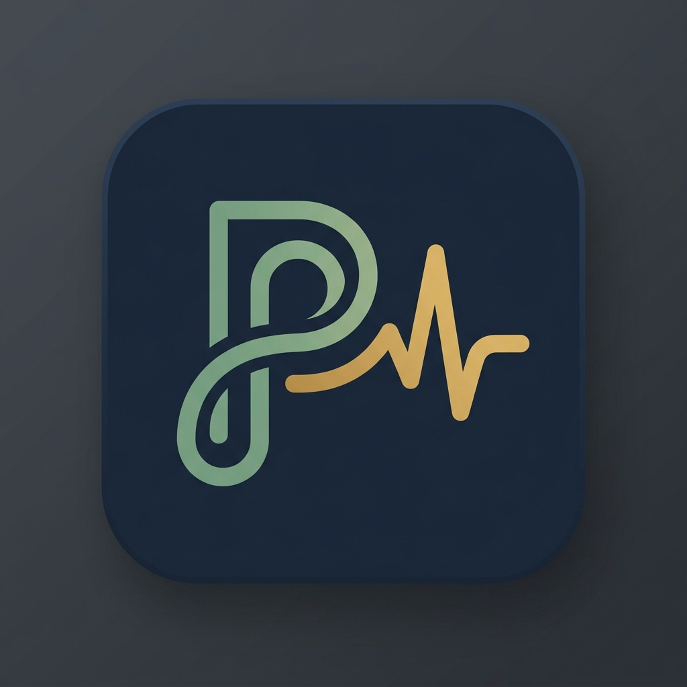

<div align="center">
  
  <h1>PulseNews</h1>
  <p><strong>An intelligent, privacy-first Android news reader powered by on-device NLP and a personalized backend feed.</strong></p>

  
  
  
  
  -blue)
  
</div>

---

PulseNews is a production-grade Android news application that goes far beyond a simple RSS reader. It combines a Pulse backend API with on-device NLP (TextRank summarization, Aho-Corasick keyword matching), Firebase-backed user accounts, and a fully configurable personalization algorithm — all wrapped in a strict Clean Architecture that passes an automated zero-trust permission baseline on every build.

## Table of Contents

- [Features](#features)
- [Architecture](#architecture)
- [Tech Stack](#tech-stack)
- [Getting Started](#getting-started)
- [Configuration](#configuration)
- [Project Structure](#project-structure)
- [Testing](#testing)
- [Known Issues & Roadmap](#known-issues--roadmap)

---

## Features

### Core Reading Experience
- **Personalized "For You" feed** — A server-side algorithm combines user interaction telemetry with configurable topic weights to surface articles ranked by relevance.
- **Category & source filtering** — Persistent filters by topic, region, and language are preserved across sessions via DataStore.
- **In-app reader mode** — Articles are rendered through a Readability4J / Jsoup extraction pipeline directly inside a `WebView`-backed reader, offering typography controls (font size, line spacing, bionic reading) and a progress strip.
- **Audio playback** — ExoPlayer-powered text-to-speech narration with a persistent `AudioPlaybackController` composable and MediaSession integration.
- **Trending topics** — Real-time trending chips on the Search screen, fetched from the Pulse backend.

### AI-Powered Summarization
- **On-device TextRank** — Before fetching a server summary, PulseNews runs a local `TextRankSummarizer` / `TextRankScorer` pipeline that builds a cosine-similarity adjacency graph and iterates PageRank to extract the most informative sentences.
- **Server AI summaries** — Authenticated users can request a backend-generated AI summary via `POST /api/news/{id}/summary`.
- **Graceful degradation** — `AiSummaryResult` is a sealed class (`Success`, `RateLimitExceeded`, `Error`), so the UI always has a well-typed fallback state.

### Personalization & Algorithm Settings
- **Configurable topic weights** — The `AlgorithmPreferencesScreen` exposes per-category sliders and geo/language selectors. Changes are persisted and pushed to the backend via `PUT /api/user/preferences`.
- **Engagement telemetry** — An `EngagementTracker` records read-time, share events, and bookmark actions. A `TelemetrySyncWorker` (WorkManager) batches these in the background using idempotency keys on `POST /api/news/telemetry`.
- **Cohort-based recommendations** — A separate `CohortTelemetryWorker` periodically syncs anonymous behavioral cohort data to improve feed ranking.

### Bookmarks & Cloud Sync
- **Offline-first bookmarks** — Articles are saved to Room (`saved_articles` table) for local offline access.
- **Cloud sync** — A `BookmarkSyncWorker` mirrors bookmarks with `POST/DELETE /api/bookmarks` using per-request `Idempotency-Key` headers. A `FirestoreSyncManager` keeps the Firestore bookmark mirror in sync for multi-device support.
- **Paginated remote bookmarks** — `GET /api/bookmarks` supports cursor-based pagination.

### Authentication
- **Google Sign-In (Credential Manager)** — One-tap Google auth via `androidx.credentials`, backed by Firebase Authentication.
- **Anonymous auth fallback** — Users can browse the public feed without signing in; personalization and cloud sync become available after sign-in.
- **Firebase token interception** — A custom `FirebaseTokenInterceptor` (OkHttp `Interceptor`) automatically attaches the Firebase ID token to every authenticated request (`X-Pulse-Auth: required`).

### Smart Notifications
- **Firebase Cloud Messaging** — `PulseNewsMessagingService` extends `FirebaseMessagingService` to receive and display breaking-news push notifications.
- **Notification preferences** — Users can configure subscribed topics, quiet hours, and a daily notification cap through `NotificationPreferencesScreen`, all persisted via DataStore.

### Design & UX
- **Material Design 3** — Full `MaterialTheme.colorScheme` + `MaterialTheme.typography` integration with automatic dark-mode support.
- **Design token system** — `NewsTokens` exposes typed spacing (`NewsSpacing`), stroke, and other primitives consumed by all composables, ensuring visual consistency.
- **Skeleton loading states** — `FeedSkeleton` composable mimics the article card layout during initial load.
- **Privacy consent** — A `PrivacyConsentDialog` is shown on first launch, gate-keeping telemetry collection.

---

## Architecture

PulseNews enforces a strict three-layer **Clean Architecture** with **MVVM** in the presentation layer.

```
┌─────────────────────────────────────────┐
│          Presentation Layer             │
│  Screen (Compose)  ←→  ViewModel        │
│  Stateless Composables + sealed events  │
└───────────────┬─────────────────────────┘
                │ UseCase calls
┌───────────────▼─────────────────────────┐
│            Domain Layer                 │
│  UseCases  ·  Domain Models  ·  Repo    │
│            Interfaces (pure Kotlin)     │
└───────────────┬─────────────────────────┘
                │ Interface implementations
┌───────────────▼─────────────────────────┐
│              Data Layer                 │
│  Retrofit API  ·  Room DB  ·  DataStore │
│  Remote Mediator  ·  Workers  ·  NLP    │
└─────────────────────────────────────────┘
```

Key architectural constraints enforced in `CLAUDE.md` and `docs/android-architectue-rules.md`:

- **Stateless Composables** — UI components receive state data classes and emit events via `onEvent: (UiEvent) -> Unit` callbacks; no business logic runs inside composables.
- **Single source of truth** — Each ViewModel exposes a single `StateFlow<UiState>`, combined from multiple data sources using `combine(...).stateIn(viewModelScope, WhileSubscribed(5_000), ...)`.
- **Sealed event bus** — All screen interactions are modelled as a `sealed interface ScreenEvent` processed by a single `onEvent()` method.
- **Dependency inversion** — ViewModels inject UseCase interfaces; concrete repositories and DAOs are never directly visible to the presentation layer.
- **Zero-trust permission baseline** — A Gradle task (`enforcePermissionBaseline`) runs on every `preBuild` and fails the build if any permission outside the approved set (`INTERNET`, `ACCESS_NETWORK_STATE`, `POST_NOTIFICATIONS`, `FOREGROUND_SERVICE`, `FOREGROUND_SERVICE_MEDIA_PLAYBACK`) is declared in the manifest.

---

## Tech Stack

| Category | Library / Tool |
|---|---|
| **Language** | Kotlin 2.x |
| **UI** | Jetpack Compose + Material Design 3 |
| **Architecture** | Clean Architecture · MVVM · StateFlow |
| **DI** | Hilt (Dagger) + KSP |
| **Networking** | Retrofit 2 + OkHttp + Moshi (codegen) |
| **Database** | Room (Paging 3 integration, versioned schema) |
| **Persistence** | Jetpack DataStore (Preferences) |
| **Paging** | Jetpack Paging 3 + `RemoteMediator` |
| **Background Work** | WorkManager (Hilt-injected workers) |
| **Image Loading** | Coil |
| **Authentication** | Firebase Auth + Google Credential Manager |
| **Push Notifications** | Firebase Cloud Messaging |
| **Cloud Sync** | Firebase Firestore |
| **HTML Parsing** | Jsoup + Readability4J |
| **Audio** | ExoPlayer (Media3) + MediaSession |
| **Reactive** | Kotlin Coroutines + Flow |
| **Immutable Collections** | `kotlinx.collections.immutable` (HAMT) |
| **NLP** | TextRank · Aho-Corasick · Cosine Similarity (on-device) |
| **Testing** | JUnit 4 · MockK · `kotlinx-coroutines-test` · Turbine |

---

## Getting Started

### Prerequisites

- **Android Studio** Ladybug (2024.2) or newer
- **JDK 17**
- **Android device / emulator** running Android 10 (API 29) or higher
- A **Firebase project** (see [Configuration](#configuration))
- A **Pulse backend** instance with the API described in `docs/All-Enpoints/`

### Installation

1. **Clone the repository**
   ```bash
   git clone https://github.com/Kutubuddin-Rasel/PulseNews.git
   cd PulseNews
   ```

2. **Open in Android Studio**
   File → Open → select the project root.

3. **Configure secrets** (see [Configuration](#configuration) below)

4. **Build and run**
   ```bash
   ./gradlew assembleDebug
   # or just press ▶ Run in Android Studio
   ```

---

## Configuration

All secrets are injected at build time via `local.properties` (never committed to VCS).

Create or edit `local.properties` in the project root:

```properties
# Pulse backend base URL
PULSE_BASE_URL=https://your-backend.example.com/

# Google Sign-In Web Client ID (from Firebase Console → Authentication → Sign-in method → Google)
WEB_CLIENT_ID=YOUR_GOOGLE_WEB_CLIENT_ID

# (Optional) NewsAPI key used by the legacy NewsApi interface
NEWS_API_KEY=YOUR_NEWS_API_KEY
```

> [!IMPORTANT]
> You must also place your **`google-services.json`** (downloaded from Firebase Console → Project settings) into `app/`. Without it, the Gradle `google-services` plugin will fail the build.

> [!NOTE]
> Both `NEWS_API_KEY` and `WEB_CLIENT_ID` can alternatively be passed as Gradle properties (`-PNEWS_API_KEY=…`) or environment variables (`export NEWS_API_KEY=…`), which is the recommended approach for CI/CD pipelines.

---

## Project Structure

```
app/src/main/java/com/example/newsapp/
├── Api/                    # Retrofit interface (PulseBackendApi)
├── Hilt/                   # Dagger-Hilt modules (Database, Network, Algorithm, DataStore…)
├── Navigation/             # NavGraph, App composable, NavigationItem definitions
├── Room/                   # Room DAOs, TypeConverters, ArticleDatabase
├── Screen/                 # Jetpack Compose screens
│   ├── HomeScreen.kt
│   ├── WebScreen.kt        # Reader mode with NLP summarization & TTS
│   ├── SearchScreen.kt
│   ├── SavedArticle.kt
│   ├── PulseProfileScreen.kt
│   ├── SettingsScreen.kt
│   ├── AlgorithmSettingsScreen.kt
│   └── NotificationPreferencesScreen.kt
├── ViewModel/              # HiltViewModels (HomeViewModel, WebScreenViewModel…)
├── data/
│   ├── remote/dto/         # Moshi-serialized DTOs (PulseArticleDto, TaxonomyDto…)
│   ├── repository/         # Repository implementations + RemoteMediator + PagingSource
│   ├── util/               # AuthManager, AiSummarizer, FirestoreSyncManager
│   │   └── nlp/            # TextRankScorer, TextRankSummarizer, SimilarityCalculator
│   └── worker/             # WorkManager workers (Telemetry, Bookmark, Cohort sync)
├── domain/
│   ├── model/              # Pure domain models (Article, TrendingTopic, GamificationProfile…)
│   ├── repository/         # Repository interfaces
│   ├── usecase/            # Single-responsibility UseCases
│   └── util/               # AhoCorasickEngine, HtmlParser, SettingsManager
├── module/                 # Shared data-class definitions (Article entity)
├── service/                # PulseNewsMessagingService (FCM)
├── ui/
│   ├── components/         # Reusable composables (ArticleCard, AiSummaryCard, AudioPlaybackController…)
│   ├── theme/              # NewsAppTheme, color scheme, typography
│   └── tokens/             # NewsTokens (NewsSpacing, NewsStroke)
└── MainActivity.kt
```

---

## Testing

The project includes unit tests and data-layer integration tests, co-located with the source under `app/src/test/`.

```bash
# Run all unit tests
./gradlew test

# Run a specific test class
./gradlew testDebugUnitTest --tests "com.example.newsapp.ViewModel.HomeViewModelAuthFlowTest"
```

Key test suites:

| Test Class | Coverage |
|---|---|
| `HomeViewModelAuthFlowTest` | Auth state toggling, flow non-caching |
| `NewsRepositoryImplTest` | Firehose sync, malformed node resilience |
| `NewsRepositoryCategoryFilterTest` | Category filter correctness |
| `SearchPagingSourceTest` | Paging source load states |
| `PulseArticleDtoTest` | DTO parsing, AI summary field extraction |

> [!NOTE]
> Room migration tests live under `app/src/androidTest/`. Run them with `./gradlew connectedAndroidTest`. The Room schema JSON files committed in `app/schemas/` serve as the migration baseline.

---

## Known Issues & Roadmap

> [!WARNING]
> The following issues were identified in the internal architectural audit. They do not affect basic functionality but are scheduled for remediation.

| ID | Severity | Description |
|---|---|---|
| ARC-1 | High | `WebScreenViewModel` holds 15 injected dependencies; needs decomposition |
| ARC-2 | High | `HomeViewModel.signIn()` captures an Activity context in a suspended coroutine |
| ARC-3 | Medium | `TextRankScorer.scoreSentences()` runs O(N²×M) on the caller's thread |
| ARC-4 | Medium | `Article` domain model is annotated as a Room `@Entity`, coupling layers |
| ARC-5 | Low | `ArticleDao` loads all saved articles as `Flow<List<Article>>`; should use Paging 3 |

**Roadmap**
- [ ] Decompose `WebScreenViewModel` into focused sub-ViewModels (Reader, NLP, Audio)
- [ ] Migrate `TextRankScorer` to `Dispatchers.Default` with a sparse-matrix optimisation
- [ ] Introduce a dedicated `ArticleUiModel` to decouple the Room entity from the UI
- [ ] Add instrumented UI tests (Compose testing)
- [ ] Publish to Google Play internal testing track
